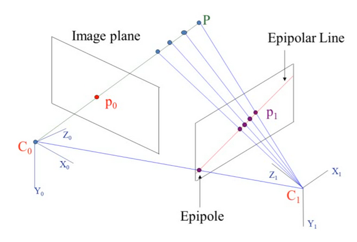

# Visual Odometry
By: Jojo Liu and Andrew Kurtz 

## Introduction
In this project, we implement monocular visual odometry in Python using OpenCV, applying it to the [KITTI dataset](https://www.cvlibs.net/datasets/kitti/eval_odometry.php). We explain the math behind the core concept, the essential matrix, and wrote a custom implementation of it.

Taking a step back, visual odometry is the process of determining a robot's position and orientation velocity using one or more cameras. Monocular visual odometry is the case when you use one camera. This is frequently used as a core part of visual SLAM, in drone localization, and/or in combination with other forms of odometry using a Kalman filter.

Here is a demo of our algorithm running. The main window shows the camera feed and the smaller window shows the current estimated position. The final few frames show the estimated trajectory compared to the ground truth. 
<p align="center">
  
</p>

### Division of Labor

To ensure we both gained a deep understanding of visual odom, we both intially wrote seperate implementations and learned the math. Then, Andrew went deeper on understanding and optimizing the implementation whereas Jojo focused on writing a custom implementation to calculate the essential matrix. 
Finally, we came back and compared and consolidated into our final implementation and write-up. You can see our seperate implementations in the `drafts` folder of the git history. We decided to remove them from the final repo for clarity. 

### Running Code

To run the code locally, clone the repo, then install the dependencies with:

```
pip install -r requirements.txt
```

Next, download the Grayscale Odometry Dataset and Ground Truth Poses from the [KITTI dataset](https://www.cvlibs.net/datasets/kitti/eval_odometry.php). You will need to create an account. After unzipping both, we move each sequence’s ground truth file into its corresponding folder within the odometry dataset and rename it to `truth.txt. The structure for a single sequence should look like this:

```
sequences
├── 00
│   ├── calib.txt
│   ├── image_0
│   ├── image_1
│   ├── times.txt
│   └── truth.txt
```

Next, you can update the path `DATA_DIR` at the top of `main.py` to match the path to the sequence you would like to test. Finally, you can run `main.py`.

## Algorithmic Overview

The system combines many core concepts of computer vision by integrating OpenCV functions into a cohesive pipeline. Here we will walk through that pipeline, explain what each step is doing, and the key design decisions.

### 1. Image Undistortion and Rectification

In a typical pipeline the first step would be undistorting and rectifying the images using the known camera intrinsics. This makes the images follow the pinhole camera model closely and makes the assumptions made in the math as accurate as possible. However, in our case the KITTI dataset images are already undistorted, so we left this out of our pipeline.

### 2. Feature Detection with FAST

Our real first step is extracting features. This gives us the anchors to track between frames. There are many algorithms available to do this. We chose to use FAST, because it is fast and computationally efficent. In a real world scenario where visual odom is a small part of a larger robotics system, saving compute for the more advanced tasks is important. Additionally, since we are using optical flow in the next step, we don't need the descriptors to match keypoints. 

Feature detection isn't needed at every iteration because we can track keypoints locations between frames with optical flow. However, the number of tracked keypoints decrease as the keypoints move out of frame. To ensure there is always enough reliable keypoints to reliably estimate motion, we rerun feature detection everytime the number of keypoints drops below a threshold, which is currently 2000.

### 3. Optical Flow

This step tracks how the keypoints move between frames. We use the Lucas–Kanade algorithm, implemented by OpenCV because it is efficient and reliable. It works by comparing the image patches around the keypoint with the same patch in the next image to compute the motion between them.

The other option to find how the keypoints move is to redetect keypoints in the next frame, then use a matching algorithm to match keypoints by their descriptors. This is less efficient because you have to redetect keypoints, calculate their descriptors, then run many comparisons per keypoint. It is also difficult to tune the matching to be reliable.

### 4. Essential Matrix and Transformations

The next step is to calculate the Essential Matrix, which estimates the transformation in camera and therefore robot locations. We will go into the theory of the essential matrix, how it is calculated, and our custom implementation in the next section.

One thing that is worth noting in this step is that the random sample concensus (RANSAC) algorithm is used to fit the most accurate essential matrix. This is because some noise inevitably gets passed on from the optical flow step. To filter it out, RANSAC calculates many potential essential matrices, then chooses the most accurate one, scored by how many other keypoints follow this motion.

Another important note is that the essential matrix only calculates the translation up to scalar. While due to time constraints we used a work around method to overcome this limitation, we will discuss approaches to handle this and calculate the scale in the 'next steps' section.

### 5. Applying Scale

To extract the scale of the translation, we relied on using the ground truth data to find the euclidean distance of the locations between frames. The translation vector can then be multiplied by this magnitude value to figure out the exact x, y, and z translation.

Using this workaround partly defeats the purpose of the visual odometry, because this is a core part of the very thing we are trying to measure. However, for the scoping of the project in order to have time to understand the math theory this was appropriate. Again, we will discuss additional steps that can be added to find scale in the 'next steps' section.

### 6. Updating Position

To update the current position (time i) of the robot relative to the initialization you can apply the transformation from the last pose (at time i - 1). Here $R_e$ represents the rotation extracted from the essential matrix and $t_e$ is the extracted and scaled translation.

$$R_i = R_e R_{i-1}$$
$$t_i = t_{i-1} + R_{i-1}t_e$$

## Epipolar Geometry and the Essential Matrix

### Math
The concept of the **Essential Matrix** can be constructed from geometrical constraints. Reference the diagram below:

<p align="center">
  
</p>

Point $$P$$ represents a detected keypoint in an arbitrary world-frame, and is projected onto the **left image plane** as point $$p_0$$ through a “light-ray” that intersects the left camera’s center $$C_0$$ that lies behind the center of the image plane. Now focusing on the **right image plane**, even if we do not know the exact distance $$P$$ is from $$C_0$$, since $$P$$ is along the ray, the projection of $$P$$ onto the **right image plane** must lie along the **epipolar line**. This provides the most important geometrical constraint towards formulating the **Essential Matrix**: the camera centers ($$C_0$$, $$C_1$$), the keypoints projections ($$p_0$$, $$p_1$$), and the keypoint $$P$$ all must lie within the same plane, which is defined as the **epipolar plane**.

To define this mathematically, in order for 3 vectors to be co-planar, they must satisfy the following relationship: $$a \cdot (b \times c) = 0$$. To apply this in the case above, $$p_0$$ and $$p_1$$ can be defined as a 3 element vector $$\mathbf{p} = [x, y, 1]^T$$ with respect to their camera frames, where $$x$$ and $$y$$ represent normalized pixel coordinates and $$z = 1$$ represents a dimensionless focal length. Converting a pixel coordinate into $$\mathbf{p}$$ can be done through multiplication with a camera calibration matrix. Substituting in values to the constraint, $$a = \mathbf{p_0}$$, $$b = \bf{t}$$ represents the translation of the camera from $$C_1$$ to $$C_0$$, and $$c = \mathbf{R{p_1}}$$ where $$\mathbf{R}$$ represents the rotation from $$C_1$$ to $$C_0$$, and thus $$\mathbf{R{p_1}}$$ represents $$\mathbf{p_1}$$ in $$C_0$$’s frame. This results in the following formulation: 

$$
\mathbf{p_0^T} [T]\_{\times} R \mathbf{p_1} = 0
$$

where $$[T]\_{\times}$$ is the 3x3 skew asymmetric matrix representing the corresponding cross product. This allows for further simplification to:

$$
\mathbf{p_0^T E p_1} = 0
$$

where $$\mathbf{E}$$, the **Essential Matrix**, relates the image of a point in one camera to its image in another camera, given a translation and rotation. Essentially (no pun intended), it encodes the transformation from the perspective of $$C_1$$ to $$C_0$$ given the same image scene. Once we solve for $$\mathbf{E}$$, we can reconstruct motion between 2 image frames.

To solve for $$\mathbf{E}$$, the first step is expanding the above:

$$
\begin{bmatrix}
x_0 & y_0 & 1
\end{bmatrix} 
\begin{bmatrix}
E_{11} & E_{12} & E_{13} \\
E_{21} & E_{22} & E_{23} \\
E_{31} & E_{32} & E_{33}
\end{bmatrix}
\begin{bmatrix}
x_1 \\
y_1 \\ 
1
\end{bmatrix} = 0
$$

Which then can be re-strucutred as a homogeneous system of equations $$A\mathbf{e} = 0$$

$$
\begin{bmatrix}
x_1^1 x_0^1 & x_1^1 y_0^1 & x_1^1 & y_1^1 x_0^1 & y_1^1 y_0^1 & y_0^1 & x_1^1 & y_1^1 & 1 \\
x_1^2 x_0^2 & x_1^2 y_0^2 & x_1^2 & y_1^2 x_0^2 & y_1^2 y_0^2 & y_0^2 & x_1^2 & y_1^2 & 1 \\
x_1^3 x_0^3 & x_1^3 y_0^3 & x_1^3 & y_1^3 x_0^3 & y_1^3 y_0^3 & y_0^3 & x_1^3 & y_1^3 & 1 \\
\vdots & \vdots & \vdots & \vdots & \vdots & \vdots & \vdots & \vdots & \vdots\\ 
x_1^N x_0^N & x_1^N y_0^N & x_1^N & y_1^N x_0^N & y_1^N y_0^N & y_0^N & x_1^N & y_1^N & 1 \\
\end{bmatrix} 
\begin{bmatrix}
E_{11} \\
E_{12} \\
E_{13} \\
\vdots \\
E_{33}
\end{bmatrix} = 0
$$

Where $$A$$ is the constraint matrix with each row representing a keypoint correspondance between the 2 frames and $$\mathbf{e}$$ is a vectorized $$\mathbf{E}$$. However, because $$\mathbf{e}$$ is part of a homogeneous system of equations, it can only be defined up to scale (more on this in the limitations section). Since it is not possible to determine the scale of the solution, this removes a degree of freedom from the constraints, decreasing the necessary keypoint correspondences from 9 (size of to $$\mathbf{e}$$) 8. This means the size of $$\mathbf{E}$$ must be at least 8x9.

With real data, being able to solve $$A\mathbf{e} = 0$$ directly is unlikely. Instead, solving the least squares problem $$\min_{\lvert \mathbf{e} \rvert=1} \lvert A\mathbf{e} \rvert ^2$$ yields a strong approximation for $$\mathbf{e}$$. Using Langrange multipliers yields $$A^TA = \lambda\mathbf{e}$$, where minimizing the eigenvalue gives the best approximation for $$\mathbf{e}$$. This means the eigenvector corresponding to the smallest eigenvalue is the best solution approximation. However, computing eigenvectors of the squared matrix $$A^TA$$ may be numerically unstable, so instead it is best practice to solve for $$\mathbf{e}$$ using SVD. The problem is then structured as such:

$$
A = U \Sigma V^T
$$

where the best solution approximation for $$\mathbf{e}$$ is the right-most column vector of $$V$$, which corresponds with the smallest singular value. By minimizing the singular value in this case, this minimzes the algebraic residue of $$A\mathbf{e} = 0$$. 

Once $$\mathbf{e}$$ is solved for, the next step is to reshape it back into the 3x3 matrix $$\mathbf{E}$$. The last major step is to enforce a rank 2 constraint on $$\mathbf{E}$$, since $$\mathbf{E} = [T]\_{\times} R$$, where $$[T]\_{\times}$$ is rank 2. This can be done through performing SVD on $$\mathbf{E}$$ and setting its smallest singular value to 0, then reconstructing it through multiplying $$U$$, the modified $$\Sigma$$, and $$V^T$$ together. Once $$\mathbf{E}$$ is finalized, rotation and translation can be recovered from it.

### Testing Our Custom Implementation

### Comparison to OpenCV Implementation

## Conclusion

### Limitations and Future Work

As discussed above, the main limitation of solely relying on the essential matrix for visual odometry is losing scale of the translations. If we had more time, we would explore the techniques to recover scale. One of the main ones is triangulation with a global map. This creates a point cloud of the surroundings from the images, where the entire map is accurate up to a scalar. If there is an object of known size at a single point, the entire global scale of the map can be calculated. An alternative method is using stereo vision, which is where you have two cameras a fixed distance apart. This allows you to triangulate the exact depth, and therefore scale.

JOJO ADD ESSENTIAL MATRIX CALCULATION LIMITATIONS

### Challenges and Lessons

One of the main lessons from this project was how to approach learning about a complex topic that we have little experience with. It was challenging to first get our feet under us because we needed resources that were a middle ground of being technically rigorous, but accessible. Additionally, there are many different approaches and design decisions in visual odometry, so it was confusing to bounce between resources. To resolve this, we eventually found one resource was that accessible, and technically rigerous enough to get started. Then, after working from this one, we developed a strong enough core understanding to filter new resources to fill in the gaps. 

JOJO ADD YOUR CHALLENGES AND LESSONS

## Sources

[Avi Singh's Blog](https://avisingh599.github.io/vision/monocular-vo/) - This was the resource that balanced accessibility and rigor to get started

[OpenCV Documentation](https://docs.opencv.org/4.x/) - Used to figure out how to use OpenCV functions

[Stanford CS231a on Camera Models](https://web.stanford.edu/class/cs231a/course_notes/01-camera-models.pdf) - Useful to understand the basics of how cameras work

[Stanford CS231a on Epipolar Geometry](https://web.stanford.edu/class/cs231a/course_notes/03-epipolar-geometry.pdf) - Helped understand basics of epipolar geometry

[William Hoff's CV Playlist](https://www.youtube.com/playlist?list=PL4B3F8D4A5CAD8DA3) - Watched lectures 23-1 and 23-2 to understand math of epipolar geometry
